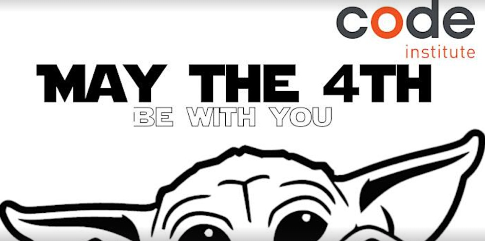
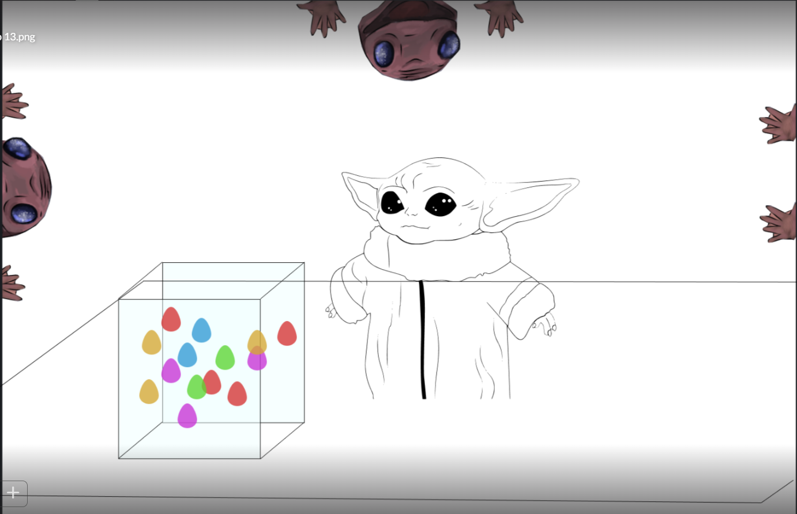
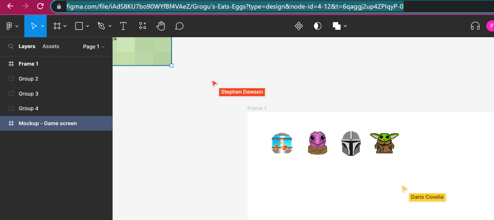
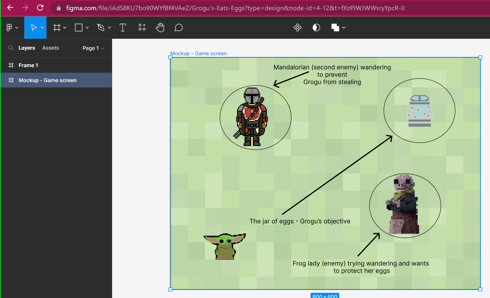
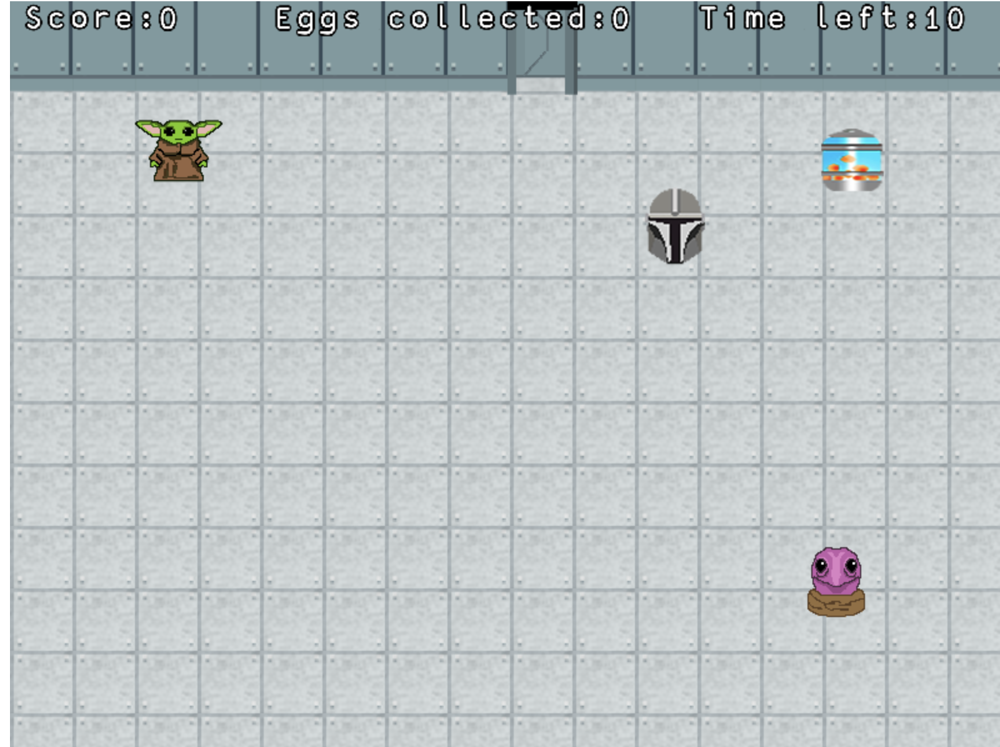
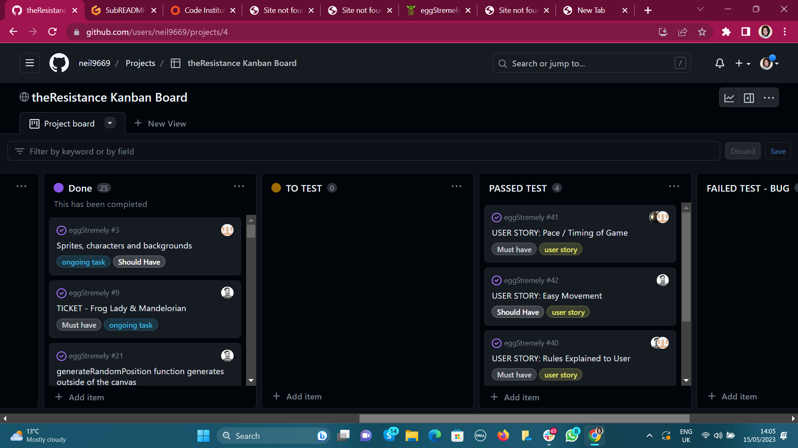

#   <em></em>Eggscapades of the Child</em>: A Star Wars Game  

## by **theResistance**

 

 

**In a galaxy far far away...**

**Grogu wants eggs, and you're his only hope!!**
  
     

The child is aboard a ship with the Frog Lady and her jar of delicious eggs. He's not meant to eat them, but they taste so good!

Can you grab as many eggs as you can from the jar, when the Frog lady isn't looking? 
Be careful, or she'll catch you!
If you're really smart, you might even get to see your elusive protector, the Mandalorian. 
But he's not keen on you eating those eggs, either, so that's double trouble!

 

**May The 4th Be With You...** 
 
 
Live link for the game (deployed via GitHub pages): https://eggscapades.plamersaurus.co.uk/
 
 
 

## Introduction

 
 
This is a README for a game designed by Team 3, also known by some in the galaxy as "theResistance".  
 
The brief was to design and code a game with the Star Wars theme for the Code Institute's May 2023 Hackathon. Our game, called 'Eggstremely', is based on events that take place in episode 2 of season 2 of The Mandalorian (a Star Wars series aired by the Disney+)
 
 
**Time limit**: 5 days after the initial briefing at 18:00 on Wednesday the 10th of May, 2023. 

**Submission**: 3pm on Monday the 15th of May.
 

**Team members (CI students and alumni):**
 

**CI Team Facilitator: Joy Zadan**
 
 

* Stephen Dawson (https://www.linkedin.com/in/sdstephendawson/)
* Dario Covella  (http://linkedin.com/in/dariocovella)
* Neil
* Oluwaseun Olawunmi Adeoye 
* Peter Anny-Nzekwue (team leader)
* Farah Maria Rahman (scrum master) (https://www.linkedin.com/in/farahmr/)
 
 

## Judging Criteria

How much fun is the game to play?

The project uses an original or innovative idea, design, or implementation.

The project was well-planned and executed, using GitHub Projects.

Project uses (or expands upon) the provided readme template.

The project focus is realistic, and has an overall sense of completeness.
 
 

## Technologies

* Kaboomjs.com
* JavaScript
* HTML
* CSS
* GitHub (Git version control and deployment)
* Photoshop (assets)
* Figma (wireframes and mockups)
 
 

## Wireframes, Prototypes, Ideas in the Planning Stage and Accompanying Images

 

1. This was the first visualisation of the game, in the initial stages when the player is only up against the Frog Lady (by Stephen Dawson):

 

 
 

2. All of the characters were then more fully fleshed out using photoshop (character images by Dario) and played around with in Figma:

 

 
 

3. Mockup of the main game in action: 
 

 
 

### Evolution of Ideas for the Game

This was discussed in daily meetings and then put up on Slack, where the team communicated via our own channel dedicated to the hackathon. The concept shifted from (a) to (b) --see below

 

A) Agreed First Meeting

1 - Baby Yoda picks eggs (tap on the screen).
2 - frog lady's hands appear on the screen.
3 - frog lady's head appears on the screen.
4 - if baby Yoda picks an egg when the frog lady's head peeps out on the screen, he loses 1 life.
5 - each time baby Yoda eats 10 eggs his level increases by 1.
6 - whenever baby Yoda's level increases, the frog lady's head appears quicker on the screen
7 - the game ends when baby Yoda runs out of lives
8 - Whenever baby Yoda picks an egg the score increases

B) Agreed Second Meeting

1. The dynamics of the game are a little different now: 
 i) There will be a setting such as a field or a spaceship.
 ii) The jar of eggs will populate in a random position in the field. 
 iii) Baby Yoda/The child/Grogu's objective will be to make his way to the jar of eggs using, which can be controlled using the directional buttons
 iv) The primary obstacle will be the frog lady who will initially randomly move around the screen. With increased difficulty, she will get faster, she will start moving towards Baby Yoda, and/or the Mandalorian character will appear to also try to stop Baby Yoda. 
 v) If we have time, we may also try adding other obstacles

 
As suggested by Peter, we used KaboomJS to create the game (https://kaboomjs.com/) as it has lots of built-in methods to make development easier and faster
 

## FEATURES: 

1. Scoreboard - just to show score in the one game. Scores won't be saved. 
2. An infinite number of eggs rather than a set number in the jar. 
3. Timer and Sabre that lights up for part of the bar, illustrating how many lives the player has.
4. Characters 'the Child', the Mandalorian and the Frog Lady
5. Start and End screen.
 
 
THE IMAGE BELOW SHOWS THE GAME'S SCORE FEATURE, TIMER & NUMBER OF EGGS COLLECTED BEING RECORDED:
 
 

 
THE IMAGE BELOW SHOWS THE START SCREEN
 

 

 

### FUTURE FEATURES:
 
 
1. The possibility of different coloured eggs granting the player a extra lives/ points.
2. Grogu the character to be able to use the Force in an advanced level of the game, a space bar would let him use this to get closer to the jar of eggs.
3. More sounds and Star Wars music.
4. Scores saved to a database or gspread API (Python), so that user can see how other players have performed.
5. A burping sound when the Child eats eggs and extra audio, such as the music for the Mandalorian being the soundtrack for the game.
 
 

## Epics / User Stories / Agile game development
 
Ideas for structure of this came from: https://blog.agilegamedevelopment.com/2016/04/user-story-mapping-for-games-example.html
 

1)

"Big Hairy Audacious Goal" or BHAG:

I am Grogu and I need to eat as many eggs from the jar as possible, 
but avoid the Frog Lady herself and the Mandalorian or they'll stop me!!!

2.) 
Break the BHAG down into some smaller epic stories...

- As Grogu I want to eat as many eggs as possible
- As Grogu I want to avoid the Frog Lady
- As Grogu I want to avoid the Mandalorian
- As Grogu I want to avoid any other obstacles between me and those delicious eggs!
- As Grogu I want to move as fast as possible and dodge obstacles
- As Grogu I want to pick up points and live longer to play for as long as possible.
- As Grogu I want to be able to use the Force to access advanced features of the game.
 
 
3. USER STORIES
 
 
The above 'as Grogu' epics were each attached to game functions and all issues/ User Stories (included ones listed below with 'player') were mapped on the Kanban Board, labelled according to their MoSCoW priority (Must have, Should have, Could have, Won't have):
 
https://github.com/users/neil9669/projects/4

 
List of User Stories and other tasks planned in Agile development can be found here: 
https://github.com/neil9669/eggStremely/issues  
 

**USER STORIES WITH 'PLAYER':**
 
* As the player, I want the rules and aim of the game to be clear so that I can play easily and enjoy the process of getting into the game.

* As the player, I want to make progress through the game with clear opportunities and enough obstacles to keep things interesting.

* As the player, I want to be able to able to manipulate the character using the mouse, touch or keyboard in a way that's easy to remember / consistent with how manouvers work in other games.

* As a player I can see my score at the end of the game so that improve on my score next time.

* As a player I can clearly see characters and obstacles on the screen so that I am less likely to be disadvantaged by a visual impairment.

* As a player I can see the number of points/ lives I'm picking up illustrated clearly on the screen so that I can see how I'm doing and assess how many risks I can afford to take.

* As a player it is clear and achievable how to win at the game - even if this just means getting as high a score as possible compared to the last time I played. Progress shouldn't be made impossible by obstacles, so that can feel I've had a positive user experience!

* As a the player I can manipulate the character easily using the mouse, touch or keyboard in a way that's easy to remember / consistent with how manouvering work in other games so that I can get into enjoying the game without getting confused about the basics.

* As a player I can see the aim and rules of the game at the start so that I can start playing with minimum fuss and enjoy getting into the game.

 

 

## Controls & game rules
 
* Use the arrow keys to move "The child":
* ⬆ - Move "The child" up
 
* "The child" needs to eat as many eggs as he can before getting caught!
 

## Deployed link
 

[Click here to play!](https://eggscapades.plamersaurus.co.uk/)

The game is browser based and deployed via GitHub pages
 
 

## Testing and User Feedback

 
 
End-user feedback: "It's cool. It's like snake meets the DVD screensaver! A missing feature for the game is the replay button at the end instead of having to refresh the page."
 

**ALL USER STORIES WERE TESTED AND RESULTS POSTED ON KANBAN BOARD**
 
We communicated via the comments attached to each issue.
 
 

 

 

## Resources created
 
 
* 'Using Terminal, Git and Github' by team member Stephen Dawson: https://docs.google.com/document/d/1NGC2ISKTVbaYKec6kTXVlcb3DNHHIrvRwuCfBkNa-To/edit?usp=sharing

 

* 'Setup a local development environment in Windows for the Code Institute Diploma in Full Stack Web Development' by team member Neil: https://myprojects.plamersaurus.co.uk/
 
* 'Using Terminal, Git and Github' by team member Stephen Dawson: https://docs.google.com/document/d/1NGC2ISKTVbaYKec6kTXVlcb3DNHHIrvRwuCfBkNa-To/edit?usp=sharing
 

## Resources created

* 'Using Terminal, Git and Github' by team member Stephen Dawson: https://docs.google.com/document/d/1NGC2ISKTVbaYKec6kTXVlcb3DNHHIrvRwuCfBkNa-To/edit?usp=sharing

* 'Using sound audio effects' created by Neil and Stephen Dawson:
  https://code-institute-room.slack.com/files/U050ACTDD41/F058D8U6MUY/frog-lady-double.mp3
  https://code-institute-room.slack.com/files/U050ACTDD41/F05791XKBE3/this-is-the-way-mando.mp3
  https://code-institute-room.slack.com/files/U050ACTDD41/F057S2TQ1FE/grogu-1.mp3

   

 * 'Using figma to wireframe' created by team member Stephen Dawson, Dario, Farah, Neil and Oluwaseun as contributor: 
 https://www.figma.com/file/iAdS8KU7bo90WYfBf4VAeZ/Grogu's-Eats-Eggs?type=design&node-id=0-1&t=FxbdyMbdHLoxRLvZ-0

## Bugs and Glitches!
 
Our team member Stephen Dawson patiently talked us through the process of branching, pulling and merging using GitHub.
 
For some of us, it was our first time doing this, and learning about merge conflicts, so this took some time to learn and caused some hiccups leading to the README submitted missing some sections.
 
 

## Credits
 

* [Source material: the Child eating eggs](https://youtube/W2UaJdDGQAQ)

* [Kaboom](https://kaboomjs.com/)

* Source image from the Mandalorian was taken from the Irish Sun (https://www.thesun.ie/tv/6132470/the-mandalorian-baby-yoda-eats-eggs-theory/)

* [GitHub documentation on managing access to projects in a team](https://docs.github.com/en/issues/planning-and-tracking-with-projects/managing-your-project/managing-access-to-your-projects)

* A big thank you to our Code Institute hackathon facilitator, Joy Zadan 

* 'Using figma to wireframe' created by team member Stephen Dawson, Dario, Farah, Neil and Oluwaseun as contributor:
  https://www.figma.com/file/iAdS8KU7bo90WYfBf4VAeZ/Grogu's-Eats-Eggs?type=design&node-id=0-1&t=FxbdyMbdHLoxRLvZ-0

 
 

END