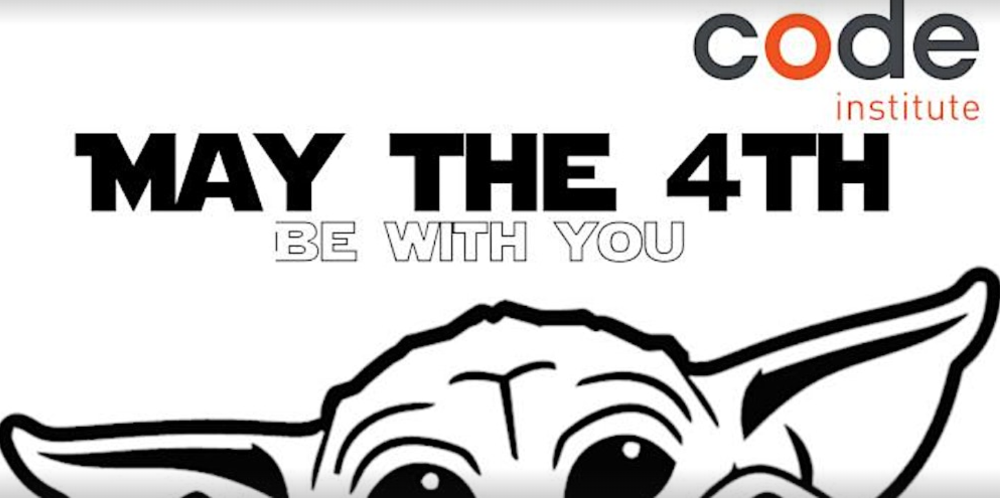
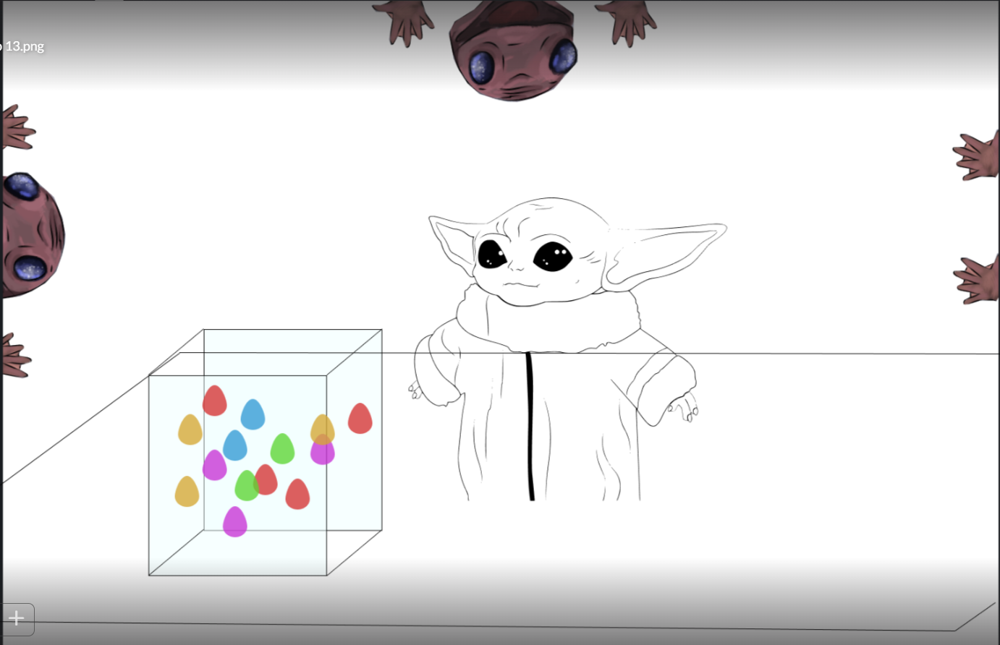
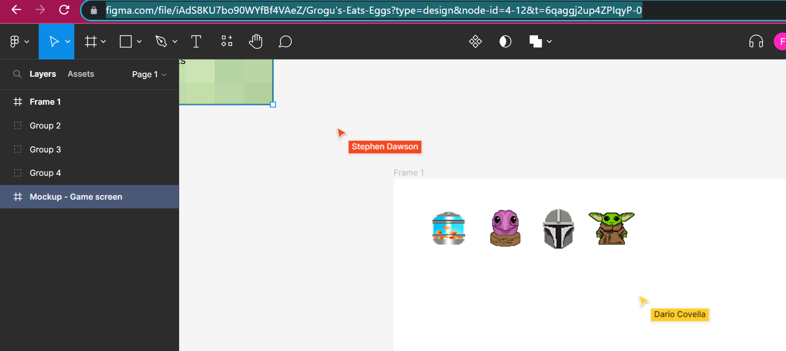

#   <em></em>EggStremely</em>: A Star Wars Game  

## by **theResistance**

 

 

**In a galaxy far far away...**

**Grogu wants eggs, and you're his only hope!!**
  
     

The child, Grogu, is aboard a ship with the Frog Lady and her jar of delicious eggs. He's not meant to eat them, but they taste so good!

Can you grab as many eggs as you can from the jar, when the Frog lady isn't looking? 
Be careful, or she'll catch you!
If you're really smart, you might even get to see your elusive protector, the Mandalorian. 
But he's not keen on you eating those eggs, either, so that's double trouble!

 

**May The 4th Be With You...** 
 
Live link for the game (deployed via GitHub pages): https://eggstremely.plamersaurus.co.uk/

 
 
## Introduction
 
 
This is a README for a game designed by Team 3, also known by some in the galaxy as "theResistance".  
 
The brief was to design and code a game with the Star Wars theme for the Code Institute's May 2023 Hackathon. Our game, called 'Eggstremely', is based on events that take place in episode 2 of season 2 of The Mandalorian (a Star Wars series aired by the Disney+)
 
 
**The time limit**: 5 days after the initial briefing at 18:00 on Wednesday the 10th of May, 2023. 

**Submission**: 3pm on Monday the 15th of May.
 

**Team members (CI students and alumni):**
 

* Stephen Dawson
* Dario  
* Neil
* Oluwaseun Olawunmi Adeoye 
* Peter Anny-Nzekwue (team leader),  
* Farah Maria Rahman (scrum master)
* Matt Stockman
 
 

## Judging Criteria

How much fun is the game to play?

The project uses an original or innovative idea, design, or implementation.

The project was well-planned and executed, using GitHub Projects.

Project uses (or expands upon) the provided readme template.

The project focus is realistic, and has an overall sense of completeness.
 
 

## Technologies

* Kaboom
* HTML
* CSS
* GitHub (Git version control and deployment)
* Photoshop (assets)
* Figma (wireframes and mockups)
 

## Wireframes, Prototypes, Ideas in the Planning Stage and Accompanying Images

 

1. This was the first visualisation of the game, in the initial stages when the player is only up against the Frog Lady (by Stephen Dawson):

 

 
 

2. All of the characters were then more fully fleshed out using photoshop (character images by Dario) and played around with in Figma:

 

 
 

3. Mockup of the main game in action: 
 

 
 

### Evolution of Ideas for the Game

This was discussed in daily meetings and then put up on Slack, where the team communicated via our own channel dedicated to the hackathon. The concept shifted from (a) to (b) --see below

 

A) Agreed First Meeting

1 - Baby Yoda picks eggs (tap on the screen).
2 - frog lady's hands appear on the screen.
3 - frog lady's head appears on the screen.
4 - if baby Yoda picks an egg when the frog lady's head peeps out on the screen, he loses 1 life.
5 - each time baby Yoda eats 10 eggs his level increases by 1.
6 - whenever baby Yoda's level increases, the frog lady's head appears quicker on the screen
7 - the game ends when baby Yoda runs out of lives
8 - Whenever baby Yoda picks an egg the score increases

B) Agreed Second Meeting

1. The dynamics of the game are a little different now: 
 i) There will be a setting such as a field or a spaceship.
 ii) The jar of eggs will populate in a random position in the field. 
 iii) Baby Yoda/The child/Grogu's objective will be to make his way to the jar of eggs using, which can be controlled using the directional buttons
 iv) The primary obstacle will be the frog lady who will initially randomly move around the screen. With increased difficulty, she will get faster, she will start moving towards Baby Yoda, and/or the Mandalorian character will appear to also try to stop Baby Yoda. 
 v) If we have time, we may also try adding other obstacles

A)

1 - Baby Yoda picks eggs (tap on the screen).
2 - frog lady's hands appear on the screen.
3 - frog lady's head appears on the screen.
4 - if baby Yoda picks an egg when the frog lady's head peeps out on the screen, he loses 1 life.
5 - each time baby Yoda eats 10 eggs his level increases by 1.
6 - whenever baby Yoda's level increases, the frog lady's head appears quicker on the screen
7 - the game ends when baby Yoda runs out of lives
8 - Whenever baby Yoda picks an egg the score increases

B)

1. The dynamics of the game are a little different now: 
 i) There will be a setting such as a field or a spaceship.
 ii) The jar of eggs will populate in a random position in the field. 
 iii) Baby Yoda/The child/Grogu's objective will be to make his way to the jar of eggs using, which can be controlled using the directional buttons
 iv) The primary obstacle will be the frog lady who will initially randomly move around the screen. With increased difficulty, she will get faster, she will start moving towards Baby Yoda, and/or the Mandalorian character will appear to also try to stop Baby Yoda. 
 v) If we have time, we may also try adding other obstacles

2. As suggested by Peter, we will use KaboomJS to create the game (https://kaboomjs.com/) as it has lots of built-in methods to make development easier and faster

### PLANNED FEATURES: 

1. scoreboard - just to show score in the one game. scores won't be saved. 
2. an infinite number of eggs rather than a set number in the jar, 
3. the possibility of different coloured eggs granting the player a extra lives/ points.
4. timer? Sabre the lights up for part of the bar showing how many lives are left

## Controls & game rules

* Arrow keys - move
* Space bar - jump
* Left Shift - use force
* Eat all the soup to progress!

### Deployed link

[Click here to play!](https://eggstremely.plamersaurus.co.uk/)

The game is browser based and deployed via GitHub pages

## Resources created

* 'Using Terminal, Git and Github' by team member Stephen Dawson: https://docs.google.com/document/d/1NGC2ISKTVbaYKec6kTXVlcb3DNHHIrvRwuCfBkNa-To/edit?usp=sharing

## Credits

* [Be sure to credit any assets that are not yours](https://www.example.com)
* [Member 1 Linkedin](https://www.linkedin.com)
* [Member 2 Linkedin](https://www.linkedin.com)
* [etc. etc.](https://www.example.com)